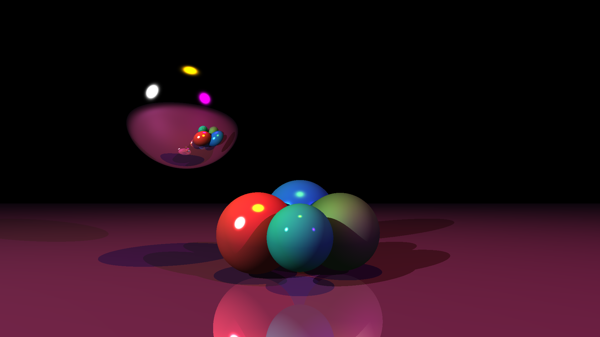
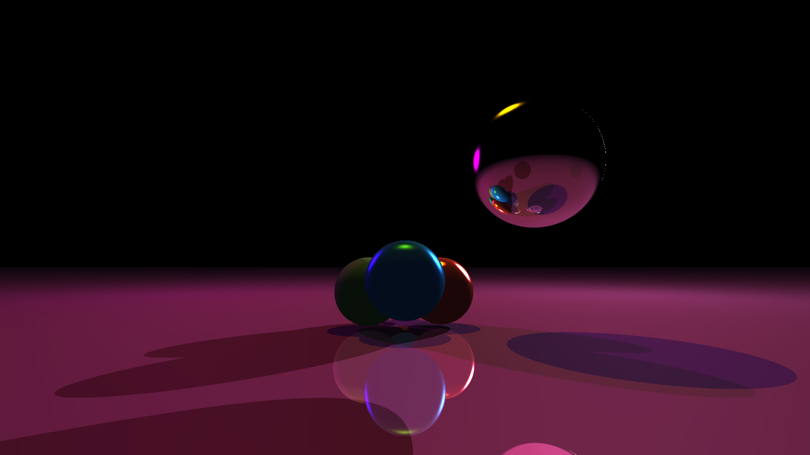
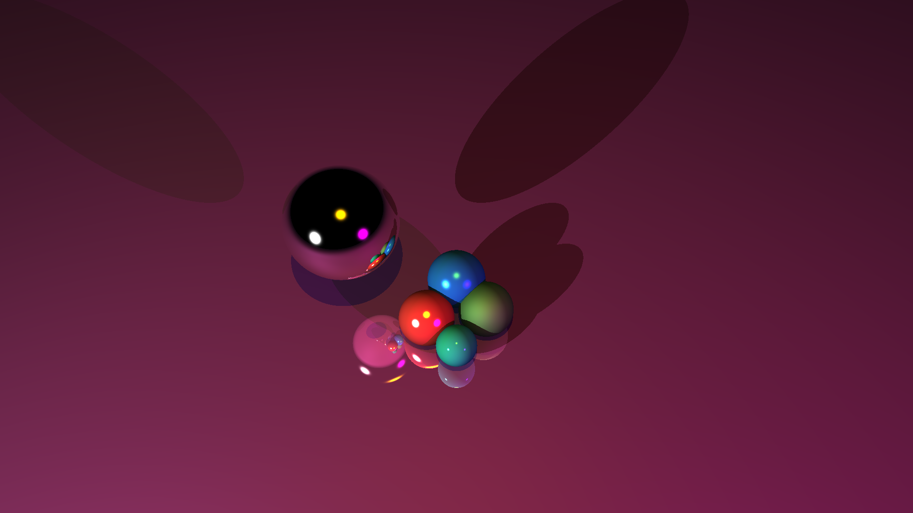

# Simple RayTracer in Rust

1. [Presentation](#presentation)
2. [Performances](#performances)
3. [Examples](#examples)
   1. [A 16K example, zoom in](#a-16k-example-zoom-in)
   2. [All side views (FHD, only from camera change)](#all-side-views-fhd-only-from-camera-change)

## Presentation

NVidia RTX tech for CPUs but not really. Do not expect huge performances, in fact, rather expect seconds per frame than frames per second. But you can create whatever you want, using :

* a ``camera`` that will provide a 3D view of the scene
* ``spheres`` and ``planes`` that are the 2 basic shapes available
* a large ``material`` config for matt of shiny shapes
* all 16581375 ``colors`` for your rainbow dreams
* ``option`` tool to toggle shadows, reflection, and more

## Performances

* FHD : eta. 1 second
* UHD : eta. 2 seconds
* 8K : eta. 20 seconds
* 16K : eta. 80 seconds

Note that these are strongly affected by the max number of reflection allowed for each rays, and from the options generally speaking. Also run the optimized version with ``cargo run --release``.

## Examples

### A 16K example, zoom in

### All side views (FHD, only from camera change)

